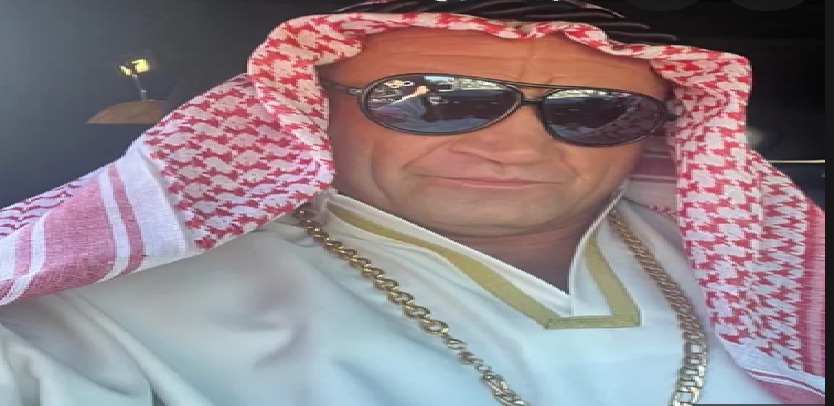

# Mariusz Pudzianowski

## Kariera
Mariusz Zbigniew Pudzianowski ps „Pudzian”, „Dominator”, Pyton, Pudzilla (ur. 7 lutego 1977 w Białej Rawskiej) – polski zawodnik mieszanych sztuk walki (MMA), wcześniej utytułowany strongman i rugbysta. 

Ośmiokrotny Mistrz Polski Strongman. Sześciokrotny Mistrz Europy Strongman w latach 2002–2004 i 2007–2009. Pięciokrotny Mistrz Świata Strongman w latach 2002, 2003, 2005, 2007 i 2008. Trzykrotny drużynowy Mistrz Świata Par Strongman w latach 2003–2005. Mistrz Super Serii w sezonach 2003/2004, 2005–2007. Zwycięzca i finalista wielu innych zawodów siłaczy.

## Trening Pudziana #1
<table>
<thead>
<tr>
<th>ćwiczenie</th>
<th>ciężar</th>
<th>ilość serii</th>
<th>ilość powtórzeń</th>
</tr>
</thead>
<tbody>
<tr>
<td>uginanie ramion ze sztangą łamaną</td>
<td>60 kg</td>
<td>4</td>
<td>8–10</td>
</tr>
<tr>
<td>uginanie ramion z prostą sztangą</td>
<td>60–70 kg</td>
<td>4</td>
<td>8–10</td>
</tr>
<tr>
<td>uginanie ramion naprzemienne z hantlami</td>
<td>25 kg</td>
<td>T3</td>
</tr>
</tbody>
</table>

## Trening Pudziana #2
<table>
<thead>
<tr>
<th>ćwiczenie</th>
<th>ilość serii</th>
<th>ilość powtórzeń</th>
</tr>
</thead>
<tbody>
<tr>
<td>Uginanie podudzi na maszynie</td>
<td>6</td>
<td>20</td>
</tr>
<tr>
<td>Prostowanie podudzi na maszynie</td>
<td>6</td>
<td>15</td>
</tr>
<tr>
<td>Podciąganie się na drążku nachwytem</td>
<td>6</td>
<td>15</td>
</tr>
<tr>
<td>Podciąganie się na drążku podchwytem</td>
<td>6</td>
<td>10</td>
</tr>
<tr>
<td>Ściąganie drążka wyciągu górnego do karku</td>
<td>4</td>
<td>15</td>
</tr>
<tr>
<td>Wiosłowanie sztangą w opadzie</td>
<td>4</td>
<td>15</td>
</tr>
</tbody>
</table>

[Kariera](#kariera)

[Trening](#trening-pudziana-1)

[Trening 2](#trening-pudziana-2)
