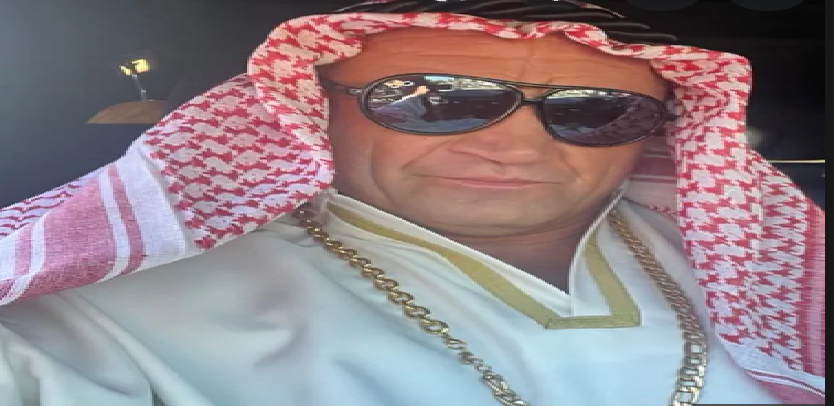

# Mariusz Pudzianowski

## Kariera
Mariusz Zbigniew Pudzianowski ps „Pudzian”, „Dominator”, Pyton, Pudzilla (ur. 7 lutego 1977 w Białej Rawskiej) – polski zawodnik mieszanych sztuk walki (MMA), wcześniej utytułowany strongman i rugbysta. 

Ośmiokrotny Mistrz Polski Strongman. Sześciokrotny Mistrz Europy Strongman w latach 2002–2004 i 2007–2009. Pięciokrotny Mistrz Świata Strongman w latach 2002, 2003, 2005, 2007 i 2008. Trzykrotny drużynowy Mistrz Świata Par Strongman w latach 2003–2005. Mistrz Super Serii w sezonach 2003/2004, 2005–2007. Zwycięzca i finalista wielu innych zawodów siłaczy.

## Trening Pudziana #1
|ćwiczenie|ciężar|ilość serii|ilość powtórzeń|
|---|---|---|---|
|uginanie ramion ze sztangą łamaną|60 kg|4|8–10|
|uginanie ramion z prostą sztangą|60–70 kg|4|8–10|
|uginanie ramion naprzemienne z hantlami|25 kg|T3|

## Trening Pudziana #2
|ćwiczenie|ilość serii|ilość powtórzeń|
|---|---|---|
|Uginanie podudzi na maszynie|6|20|
|Prostowanie podudzi na maszynie|6|15|
|Podciąganie się na drążku nachwytem|6|15|
|Podciąganie się na drążku podchwytem|6|10|
|Ściąganie drążka wyciągu górnego do karku|4|15|
|Wiosłowanie sztangą w opadzie|4|15|

[Kariera](#kariera)

[Trening](#trening-pudziana-1)

[Trening 2](#trening-pudziana-2)